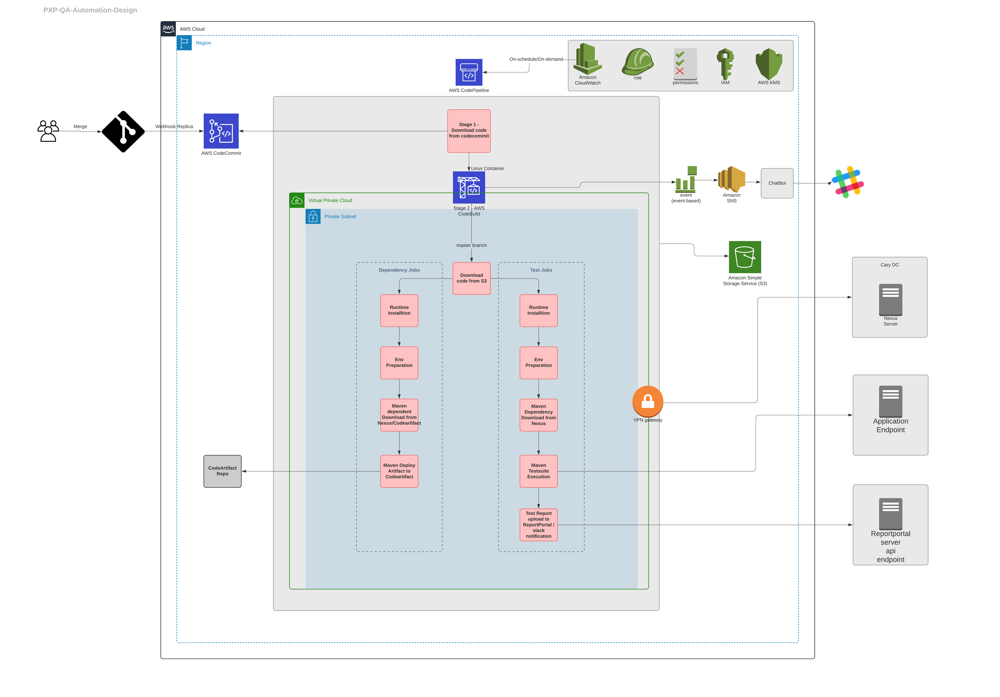

# PxP QA CodePipeline - testing-jobs resources

## Overview
This directory contains Terraform configurations to create a testing-jobs AWS resources for PxP QA CodePipeline based on Bitbucket Branch.

## Pre-requisites
The following resources are the pre-requisites from common folder
  - CodeCommit repository by the name qa-automation-mirror for mirroring the qa-automation repo from Bitbucket
  - KMS keys ARN stored in SSM parameter - /nextgen/kms/data/default for data encryption key
  - Bucket ARN stored in SSM parameter - /nextgen/codepipeline/artifact-store/default for storing CodePipeline artifacts & logs
  - SNS topic ARN for Slack notifications

## AWS Design Reference


## Terraform versions
### Recommended
- Terraform v 1.0.3 and above  
- AWS Provider v 3.59.0 and above

### Minimum
- NA

## Inputs

| Name | Description | Type | Default | Required |
|------|-------------|------|---------|:--------:|
| codebuild\_artifacts\_type | The build output artifact's type, default to CODEPIPELINE | `string` | `"CODEPIPELINE"` | no |
| codebuild\_compute\_type | Information about the compute resources the build project will use | `string` | `"BUILD_GENERAL1_SMALL"` | no |
| codebuild\_image | Container image to be used in AWS CodeBuild for the CI | `string` | `"aws/codebuild/amazonlinux2-x86_64-standard:3.0"` | no |
| codebuild\_image\_pull\_credentials\_type | The type of credentials AWS CodeBuild uses to pull images in your build. Available values for this parameter are CODEBUILD or SERVICE\_ROLE, default to CODEBUILD | `string` | `"CODEBUILD"` | no |
| codebuild\_privileged\_override | If set to true, enables running the Docker daemon inside a Docker container. Defaults to false. | `bool` | `true` | no |
| codebuild\_source\_type | The type of repository that contains the source code to be built. default to CODEPIPELINE | `string` | `"CODEPIPELINE"` | no |
| codebuild\_type | The type of build environment to use for related builds, default to LINUX\_CONTAINER | `string` | `"LINUX_CONTAINER"` | no |
| component | Component defination | `string` | `"PXP"` | no |
| data\_classification | Data classification for the CI/CD pipeline | `string` | `"confidential"` | no |
| environment | The name of environment. Used to differentiate costs between stacks or pipelines including those of the same type | `string` | `"dev"` | no |
| environment-type | The type of environment according to function/purpose. Used to differentiate costs between different types of use | `string` | `"test"` | no |
| bitbucket_repository_name | Same as bitbucket repository name | `string` | `"qa-automation"` | yes |
| repository\_name | The name of the repository that would be used to trigger the pipeline | `string` | `"qa-automation-mirror"` | no |
| source\_buildspec | Location of the buildspec file in the nextgen-portal-api-gateway repository | `string` | `"terraform/testing-jobs/buildspecfolder/buildspec.yaml"` | no |

## Outputs

| Name | Description |
|------|-------------|
| codebuild\_project\_role | The codebuild project role |
| codepipeline\_name | The codepipeline id created for test execution |
| cloudwatch\_event\_rule\_name | cloudwatch event rule name created for triggering pipeline execution |

## Locals
The following locals are configured as an Inputs to the testing-job terraform code, if required can be modified.

```
vpc_name                      = "main"
kms_key_id                    = data.aws_ssm_parameter.kms_data_default.value
aws_codebuild_project_arn     = "arn:aws:codebuild:${data.aws_region.current.name}:${data.aws_caller_identity.current.account_id}:project/${module.build.codebuild_project.name}"
pipeline_artifact_bucket_name = data.aws_ssm_parameter.codepipeline_artifact_store.value
pipeline_artifact_bucket_arn  = "arn:aws:s3:::${local.pipeline_artifact_bucket_name}"
name                          = "${var.bitbucket_repository_name}_${terraform.workspace}"
aws_codecommit_repo_arn       = "arn:aws:codecommit:${data.aws_region.current.name}:${data.aws_caller_identity.current.account_id}:${var.repository_name}"
selenium_browser              = "*chrome"
test_execution_mode           = "headless"
````

The following locals are configured as an Inputs mapping to each spcific testing-job terraform code, which needs modification.

```
inputs = {
  "default" = {
    codecommit_branch     = "development"
    PollForSourceChanges  = true
    execution_folder      = "pi-integration-platform-acceptance"
    test_environment      = "demo"
    suite_xml             = "integration-platform-acceptance.xml"
    build_timeout         = 240 #Number of minutes, from 5 to 480. Default value is 60 mins
    queued_timeout        = 480 #Number of minutes, from 5 to 480. Default value is 480 mins
    maven_parameter       = "mvn -U clean install"
    google_chrome_version = "93.0.4577.82-1"
    chrome_driver_version = "92.0.4515.107"
    cron_shedule          = "cron(10 6 ? * 3 *)"
    pxp_application       = "Portal"
  }
}
```
## Usage
This requires Terraform version 1.0.3 and above.

## Creating a new testing job

Each testing job is created under a workspace of its own.  

The repository is set up to substitute the current workspace name as the testing job purpose. So, make sure that the Terraform workspace by the testing job purpose is created and the selected workspace is the one whose name is the same as the defined testing job purpose.  

### Workspace for the new job
As an example, if the name of the testing job purpose is `demo-integrations2-acceptance` & the workspace is not exits, then create a workspace named `demo-integrations2-acceptance`
```
terraform workspace new demo-integrations2-acceptance
```
List the current available workspace & identify the selected workspace by symbol '*' in front of workspace name
```
terraform workspace list
```
If not already selected, then select 'demo-integrations2-acceptance' as the current workspace
```
terraform workspace select demo-integrations2-acceptance
```
### Code changes for the new job
#### **workspaces.tf**
The configuration file **`workspaces.tf`** ensures that we are making changes to a valid job created under a valid workspace. For this purpose, the list variable `valid_workspaces` has the list of all valid workspaces. 
In order to add a new job, we need to update this variable with a new workspace name specific to the job that needs to be added.  

For example:
```
locals {
  valid_workspaces = {
    demo-integrations2-acceptance = "demo-integrations2-acceptance"   # Add the workspace name here
  }
  selected_workspace = local.valid_workspaces[terraform.workspace]
}
```
#### **locals.tf**
The configuration file `locals.tf` has parameters for each individual job under the variable named `inputs`.  
Copy the `<demo-integrations2-acceptance>` section from the `locals.tf` file & paste it by changing it to supported `<testing job purpose>` as described in the `workspace.tf` also in above section. Fill in all the required information for the new testing job.

Additionally, some parameter defaults are set specifically set for specific testing job purpose/regions(for pxp-build, restricted to us-east-2).
Go through the locals section above to understand the various local reference for execution and update accordingly.  

Using the configurations is easy. Run the following commands from within the `terraform/testing-jobs/` directory:
```
terraform init
```
Create a plan
```
terraform plan -no-color -out=pipeline.tfplan
```
Review the generated plan and once satisfied execute it using the `terraform apply` command
```
terraform apply pipeline.tfplan
```
### Code changes for updating an existing job
1. In order to update the job parameters, make appropriate changes to the `locals.tf` file
1. Make sure to change the workspace to the one that was created for the job that needs to be updated
    ```
    terraform workspace select <job-workspace-name>
    ```
1. Run the terraform plan
    ```
    terraform plan -out=terraform.tfplan -no-color
    ```
1. Review the plan created by Terraform
1. Execute the reviewed plan
    ```
    terraform apply terraform.tfplan
    ```
